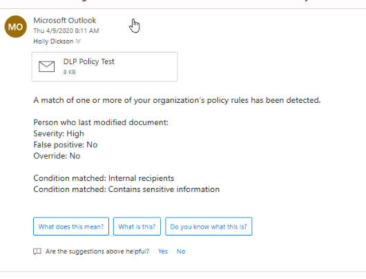

# Module 11 - Lab 11 - Exercise 2 - Test DLP Policies

You are now at the point in your pilot project where you want to test policies. You have decided to test a DLP policy related to emails that contain sensitive information. 

### Task 1 – Test a DLP Policy for Sensitive Emails

In the previous exercise, you created a custom DLP policy that searches emails for sensitive information related to U.S. Social Security numbers in your Adatum tenant. In this exercise, you will send an email with a social security number from Holly Dickson to Alex Wilber.

1. Switch to the Client 1 VM (LON-CL1), in which you should still be logged into Microsoft 365 as Holly Dickson (**holly@M365xZZZZZZ.onmicrosoft.com)** with a password of **Pa55w.rd**. 

2. You will now send an email from Holly to Alex; the email will contain US Social Security numbers. In **Microsoft Edge**, the **Outlook on the web** tab should still be open for Holly. Select the **Outlook on the web** tab.

3. In the upper left corner of the screen, select **+New message**. 

4. In the message pane that appears on the right-side of the screen, enter the following information:

	- To: start typing **Alex** and a drop-down menu displays with users whose name begins with that. Select **Alex Wilber**.

	- Add a subject: **DLP Policy Test**

	- Message area: type **This customer has social security number: 123-45-6789**.

6. Select **Send.**

7. You will now send a second message from Holly to Alex that contains multiple social security numbers.    

	‎In **Outlook**, in the upper left corner of the screen, select **+New message**. 

8. In the message pane that appears on the right-side of the screen, enter the following information:

	- To: start typing **Alex** and a drop-down menu displays with users whose name begins with that. Select **Alex Wilber**.

	- Add a subject: **multiple SSN test**

	- Message area: **SSN = 123 45 6789 and another customer SSN 111 11 1111 and a third 222 22 2222**

11. Select **Send.**

12. Switch to the Client 2 VM (LON-CL2) in the **Virtual machine** field at the top of the VM. 

13. If you need to sign into the VM, the **Admin** account should appear by default, so enter **Pa55w.rd** in the **Password** field to log in. 

7. Switch to the Client 2 VM (LON-CL2) in the **Virtual machine** field at the top of the VM.

8. In the **Edge** browser, if there are still signed in sessions, sign out of the current user account and close all **Edge** browser tabs.

9. Open your **Edge** browser, maximize the window and enter the following URL in the address bar: **https://outlook.office365.com**

10. You want to sign into **Outlook on the web** as **Alex Wilber**. If the **Pick an account** window appears, Alex’s account won’t appear since she hasn’t signed in before. Therefore, select **Use another account**. 

11. In the **Sign in** window, enter **AlexW@M365xZZZZZZ.onmicrosoft.com** (where ZZZZZZ is your unique tenant ID provided by your lab hosting provider) and then select **Next.**

12. In the **Enter password** window, enter Alex's password (hint: it's probably the same as the MOD admin password) and then select **Sign in**.

13. In the **Stay signed in?** window, select **Don’t show this again** and then select **Yes**.

14. If you approach the site for the first time, you will be asked for your language setting and your time zone:

	- From the **Language** dropdown select **English (United States).**

	- From the **Time zone** dropdown select your preferred time zone.

15. Select **Save**.

16. If a window is displayed asking whether you want to try the new outlook, select **Try the new Outlook.**

17. If a **Welcome** window appears, then close it now.

18. In **Outlook on the web**, in Alex’s **Inbox**, you should see the email message that Holly just sent to Alex containing a single SSN number.

15. The email with multiple SSNs should have been blocked and a warning message should appear in Holly's inbox (on LON-CL1) that looks something like this:

     

16. Delete the message from Alex’s Inbox as the last operation in this exercise. You have now successfully tested your custom DLP policy.

17. Leave both client VMs open for the next lab. Do not close any of the browser tabs.

**TROUBLESHOOTING this lab**

"Nothing happened, both emails went to Alex".
  
1. It can take many minutes for a DLP policy to propagate a tenant.  Most likely you sent the emails to Alex before the policy and subsequent scanning had a chance to be in place in your tenant.  If that happened come back to this lab later and resend the emails again.

2. Another possibility is that you didn't format the SSN's properly in the body of the email.  Sensitive information types in DLP policies scan for data formatted in a particular way that is common for that data type.  If you click the link below you can see exactly how US Social Security numbers must be formatted in content in order to be detected by DLP policy scans.
[https://docs.microsoft.com/en-us/microsoft-365/compliance/what-the-sensitive-information-types-look-for?view=o365-worldwide#us-social-security-number-ssn](https://docs.microsoft.com/en-us/microsoft-365/compliance/what-the-sensitive-information-types-look-for?view=o365-worldwide#us-social-security-number-ssn)

3. Check the DLP Policy configuration. Make sure you configured the policy as described in the previous exercise.

This is a good lab for testing various DLP policy configurations. Once you have successfully completed this lab consider reconfiguring this DLP policy to trigger other outcomes.

# End of Lab
